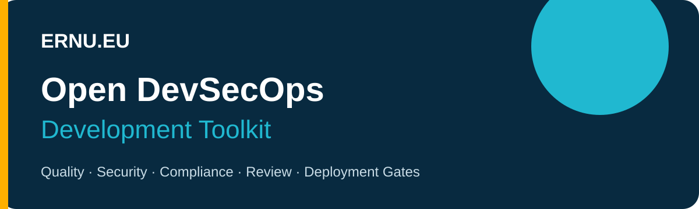

# Open DevSecOps Development Toolkit

An open-source, self-hostable blueprint for source-code quality, security,
license compliance and pull-request review. Published by **ERNU.EU** as a clean,
generic reference with no customer, infrastructure or private-repository data.

[Română](README.ro.md) · [Quick start](docs/QUICK-START.md) ·
[Full guide](docs/IMPLEMENTATION-GUIDE-RO.md) ·
[Branded PDF](docs/pdf/ERNU_EU_Open_DevSecOps_Ghid_RO.pdf)

## Recommended stack

| Control | Component | Output |
|---|---|---|
| Quality gate | SonarQube Community | maintainability and coverage |
| SAST | Semgrep CE | SARIF and custom rules |
| Compliance | MegaLinter | unified linting |
| CVE, IaC, images | Trivy | SARIF and SBOM |
| Secrets | Gitleaks | repository/history findings |
| PR annotations | Reviewdog | changed-line findings |
| Licenses | ORT | license policies |
| AI review | PR-Agent + Ollama | self-hosted advisory review |

## Adoption profiles

| Profile | Trigger | Effect |
|---|---|---|
| manual-nonblocking | GitHub UI | Reports only |
| pr-advisory | Pull request | Annotations |
| mandatory-deployment-gate | PR/release | Required before deployment |

Start manually. Promote only after baseline review, false-positive calibration
and an approved exception process.

## Repository map

~~~text
config/                 Scanner policies
docs/                   Installation and governance
examples/               Fictional sample application
platform/sonarqube/     Docker Compose reference
scripts/                Validation helpers
templates/github/       Manual and mandatory workflows
policies/               Severity and exception rules
~~~

~~~bash
chmod +x scripts/*.sh
scripts/validate-configs.sh
cp -a examples/sample-application/devsecops ./devsecops
~~~

See [mandatory deployment gates](docs/MANDATORY-DEPLOYMENT-GATE.md).

## License

Apache License 2.0. See [LICENSE](LICENSE).

